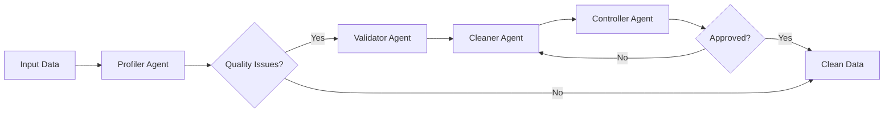

# AutoML Platform v3.2.1 - Enterprise MLOps Edition with Extended Connectors

[](https://www.python.org/)
[](LICENSE)
[](https://mlflow.org/)
[](https://fastapi.tiangolo.com/)
[](docs/expert-mode.md)
[](docs/templates.md)
[](https://onnx.ai/)
[](https://riverml.xyz/)
[](https://openai.com/)
[](https://codecov.io/)
[](https://github.com/psf/black)

Production-ready AutoML platform with **Intelligent Data Cleaning Agents**, **Use Case Templates**, **Extended Data Connectors**, **Expert Mode** for advanced users, enterprise MLOps capabilities including incremental learning, real-time streaming, advanced scheduling, billing system, and LLM-powered insights.

## 🤖 NEW: Intelligent Data Cleaning with OpenAI Agents

The platform now includes **AI-powered data cleaning agents** using OpenAI's GPT-4 for intelligent, context-aware data preprocessing.

### 🧹 Intelligent Cleaning Features

#### Multi-Agent Architecture

The system uses 4 specialized OpenAI agents working in concert:

| Agent | Role | Tools | Purpose |
|-------|------|-------|---------|
| **Profiler Agent** | Data Quality Analysis | Code Interpreter | Analyzes data quality, detects anomalies, generates statistics |
| **Validator Agent** | Standards Validation | Code Interpreter, Web Search | Validates against sector standards (IFRS, HL7, etc.) |
| **Cleaner Agent** | Intelligent Cleaning | Code Interpreter, File Search | Applies context-aware transformations |
| **Controller Agent** | Quality Control | Code Interpreter | Validates results, ensures compliance |

### 🚀 Quick Start with Intelligent Cleaning

#### Installation

```bash
# Install additional dependencies
pip install "automl-platform[agents]"

# Or install specific dependencies
pip install openai>=1.0.0 beautifulsoup4>=4.11.0

# Set your OpenAI API key
export OPENAI_API_KEY=your_api_key_here
export ENABLE_INTELLIGENT_CLEANING=true
export MAX_CLEANING_COST_PER_DATASET=5.00
```

#### Basic Usage

```python
from automl_platform.agents import IntelligentDataCleaner
import pandas as pd
import asyncio

# Load your data
df = pd.read_csv("data.csv")

# Initialize intelligent cleaner
cleaner = IntelligentDataCleaner()

# Define context for sector-specific cleaning
user_context = {
    "secteur_activite": "finance",  # Sector: finance, sante, retail, etc.
    "target_variable": "default_risk",
    "contexte_metier": "Credit risk assessment for loan approval"
}

# Run intelligent cleaning
async def clean_data():
    cleaned_df, report = await cleaner.smart_clean(df, user_context)
    return cleaned_df, report

# Execute
cleaned_df, report = asyncio.run(clean_data())

# Review quality improvement
print(f"Quality Score: {report['summary']['final_quality']:.1f}/100")
print(f"Quality Improvement: {report['summary']['improvement']:.1f} points")
print(f"Mode Used: {report['summary']['mode']}")
```

### 🎯 Sector-Specific Validation

The system automatically validates data against industry standards:

| Sector | Standards Checked | Validations |
|--------|------------------|-------------|
| **Finance** | IFRS, Basel III | Currency formats, transaction IDs, risk scores |
| **Healthcare** | HL7, ICD-10, FHIR | Patient IDs, diagnosis codes, lab results |
| **Retail** | GS1, SKU, UPC | Product codes, inventory, pricing |
| **Manufacturing** | ISO | Quality standards, production codes |

### 🔄 Cleaning Pipeline

The intelligent cleaning follows this pipeline:



### 📊 Example: Financial Data Cleaning

```python
from automl_platform.agents import DataCleaningOrchestrator, AgentConfig
import asyncio

async def clean_financial_data():
    # Configure agents for financial sector
    config = AgentConfig(
        openai_api_key="your_key",
        user_context={
            "secteur_activite": "finance",
            "target_variable": "loan_default",
            "contexte_metier": "Loan risk assessment"
        }
    )
    
    # Initialize orchestrator
    orchestrator = DataCleaningOrchestrator(config)
    
    # Load financial data
    df = pd.read_csv("loans.csv")
    
    # Run cleaning with sector-specific validations
    cleaned_df, report = await orchestrator.clean_dataset(df, config.user_context)
    
    # Review applied transformations
    for trans in report['transformations']:
        print(f"- {trans['action']} on {trans['column']}: {trans.get('rationale', '')}")
    
    return cleaned_df

# Execute
cleaned_df = asyncio.run(clean_financial_data())
```

### 🛠️ Advanced Features

#### Intelligent Mode Selection

The system automatically chooses the best cleaning approach:

```python
from automl_platform.agents import IntelligentDataCleaner

cleaner = IntelligentDataCleaner()

# Auto mode: Automatically selects best approach
cleaned_df, report = await cleaner.smart_clean(
    df, 
    user_context, 
    mode="auto"  # auto, agents, conversational, hybrid
)

# Get recommendations without cleaning
recommendations = await cleaner.recommend_cleaning_approach(df, user_context)
```

#### Chunking for Large Datasets

Automatically handles large datasets by chunking:

```python
# Datasets > 10MB are automatically chunked
config = AgentConfig(
    chunk_size_mb=10,  # Process in 10MB chunks
    max_iterations=3,   # Max cleaning iterations
    timeout_seconds=300 # 5-minute timeout per chunk
)
```

#### Web Search for Validation

The Validator Agent searches for sector standards:

```python
# Automatic web search for standards
validation_report = await validator.validate(df, profile_report)
# Returns:
# - IFRS standards for finance
# - HL7 standards for healthcare
# - GS1 standards for retail
```

#### YAML Configuration Export

Save cleaning configurations for reproducibility:

```yaml
# Generated cleaning_config.yaml
metadata:
  industry: "finance"
  target_variable: "default_risk"
  processing_date: "2025-01-24"

transformations:
  - column: "amount"
    action: "normalize_currency"
    params:
      target_currency: "EUR"
  - column: "date"
    action: "standardize_format"
    params:
      format: "%Y-%m-%d"

validation_sources:
  - "https://www.bis.org/basel_framework/"
  - "https://www.ifrs.org/standards/"
```

### 📈 Performance Metrics

The system tracks comprehensive metrics:

```python
# Performance metrics in report
{
    "cleaning_time_per_agent": {
        "profiler": 5.2,
        "validator": 3.8,
        "cleaner": 7.1,
        "controller": 2.9
    },
    "total_api_calls": 12,
    "total_tokens_used": 8500,
    "validation_success_rate": 95.0,
    "cost_per_row": 0.0002,
    "quality_improvement": 28.5
}
```

### 🔒 Security & Fallback

#### Data Privacy

- No sensitive data sent to OpenAI by default
- Data samples limited to 100 rows
- Column names and statistics only

#### Automatic Fallback

```python
# If OpenAI fails, falls back to traditional cleaning
try:
    cleaned_df, report = await cleaner.smart_clean(df, user_context)
except:
    # Automatic fallback to EnhancedDataPreprocessor
    cleaned_df = preprocessor.fit_transform(df)
```

#### Cost Control

```python
# Set maximum cost per dataset
config = AgentConfig(
    max_cost_per_dataset=5.00,  # $5 limit
    enable_caching=True,         # Cache results
    cache_ttl=3600              # 1-hour cache
)
```

### 🧪 Testing the Agents

```bash
# Run agent tests
pytest tests/test_agents.py -v

# Run integration tests
pytest tests/test_agents.py::TestIntegration -v

# Test with sample data
python automl_platform/examples/example_intelligent_cleaning.py
```

### 📋 Configuration Options

Set in `.env` file:

```bash
# OpenAI Configuration
OPENAI_API_KEY=your_openai_api_key_here
OPENAI_CLEANING_MODEL=gpt-4-1106-preview

# Agent Settings
ENABLE_INTELLIGENT_CLEANING=true
MAX_CLEANING_COST_PER_DATASET=5.00
ENABLE_WEB_SEARCH=true
ENABLE_FILE_OPERATIONS=true
AGENT_TIMEOUT_SECONDS=300
AGENT_MAX_RETRIES=3
AGENT_EXPONENTIAL_BACKOFF=true
```

### 🎯 When to Use Intelligent Cleaning

| Use Case | Recommended Mode | Why |
|----------|-----------------|-----|
| Regulated Industries | Agents | Automatic compliance validation |
| Unknown Data Quality | Agents | Comprehensive profiling |
| Standard Datasets | Traditional | Faster, no API costs |
| Complex Business Rules | Agents | Context-aware cleaning |
| Large Datasets (>1GB) | Traditional | Cost-effective |
| Real-time Processing | Traditional | Lower latency |

### 📊 Cleaning Results Comparison

| Metric | Traditional | Intelligent Agents |
|--------|------------|-------------------|
| Quality Score Improvement | +15-20% | +25-35% |
| Processing Time | 30s-2min | 2-5min |
| Cost per 1000 rows | $0 | $0.20-0.50 |
| Sector Compliance | Manual | Automatic |
| Outlier Detection | Statistical | Context-aware |
| Missing Value Strategy | Generic | Data-specific |

### 🚦 Best Practices

1. **Start with Profiling**: Always run quality assessment first
2. **Provide Context**: Specify sector and business context
3. **Monitor Costs**: Set cost limits for large datasets
4. **Use Caching**: Enable caching for repeated operations
5. **Review Transformations**: Check the YAML config before production
6. **Test Fallback**: Ensure traditional cleaning works as backup

### 📚 Agent Documentation

For detailed agent documentation:

```bash
# View agent architecture
cat automl_platform/agents/README.md

# Review example usage
python automl_platform/examples/example_intelligent_cleaning.py --help

# Generate cleaning report
python main.py clean --intelligent --data data.csv --sector finance --export-yaml
```

---

## 🎯 New in v3.2 - Use Case Templates

Pre-configured templates for common ML problems allow you to get started in seconds with optimized settings for your specific use case.

### Available Templates

| Template | Description | Optimized For | Key Features |
|----------|-------------|---------------|--------------|
| **Churn Prediction** | Customer retention analysis | Telecom, SaaS, Subscription services | • RFM features<br>• Time-based validation<br>• Uplift modeling ready |
| **Fraud Detection** | Anomaly detection in transactions | Finance, E-commerce | • Imbalanced learning<br>• Real-time scoring<br>• Explainability focus |
| **Sales Forecasting** | Time series prediction | Retail, Manufacturing | • Seasonal decomposition<br>• Multiple horizons<br>• Hierarchical forecasting |
| **Credit Scoring** | Risk assessment | Banking, Lending | • Regulatory compliance<br>• Fairness metrics<br>• Monotonicity constraints |
| **Recommendation System** | Personalization engine | E-commerce, Media | • Collaborative filtering<br>• Content-based<br>• Hybrid approaches |

---

## 🎓 Expert Mode vs Simplified Mode

The platform adapts to your expertise level:

### Simplified Mode (Default)
Perfect for business users and data scientists who want quick results:
- One-click model training
- Automatic feature engineering
- Pre-configured pipelines
- Visual interface with Streamlit

### Expert Mode
Full control for ML engineers and researchers:
- Custom pipeline configuration
- Advanced hyperparameter tuning
- Direct access to all algorithms
- API-first approach
- Custom metric definitions
- Raw model artifacts access

---

## 🚀 Installation

### Basic Installation

```bash
pip install automl-platform
```

### Installation with Extras

```bash
# For intelligent agents
pip install "automl-platform[agents]"

# For complete no-code experience
pip install "automl-platform[nocode]"

# For enterprise features
pip install "automl-platform[enterprise]"

# For GPU support
pip install "automl-platform[gpu]"

# Everything
pip install "automl-platform[all]"
```

### Development Installation

```bash
git clone https://github.com/automl-platform/automl-platform.git
cd automl-platform
pip install -e ".[dev]"
```

## 📖 Documentation

- [Getting Started](https://docs.automl-platform.com/getting-started)
- [API Reference](https://api.automl-platform.com/docs)
- [Templates Guide](https://docs.automl-platform.com/templates)
- [Agent Documentation](https://docs.automl-platform.com/agents)
- [Examples](https://github.com/automl-platform/automl-platform/tree/main/examples)

## 🤝 Contributing

We welcome contributions! Please see our [Contributing Guide](CONTRIBUTING.md) for details.

## 📄 License

This project is licensed under the MIT License - see the [LICENSE](LICENSE) file for details.

## 🙏 Acknowledgments

- OpenAI for GPT-4 API and Assistants framework
- MLflow for experiment tracking
- FastAPI for the API framework
- Streamlit for the UI dashboard
- The open-source community

---

**Built for everyone: From Excel users to ML engineers**

*Intelligent cleaning: AI-powered data preparation with OpenAI agents*

*Pre-configured templates: Get started in seconds with optimized settings for your use case*

*Your data, anywhere: Excel, Google Sheets, CRM, Databases - all connected*

*Version 3.2.1 - Last updated: January 2025*
